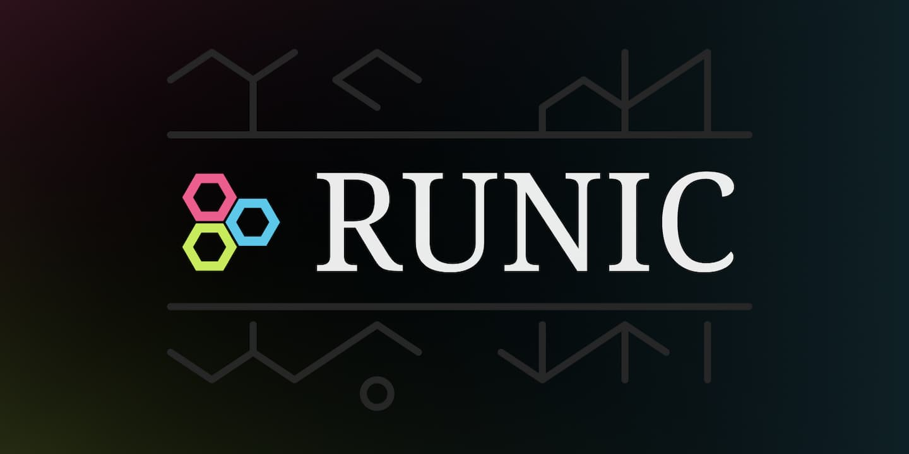

# [The Tunic Translator Tool](https://aryanpingle.github.io/Runic/)

<p align="center">
    
</p>

Tunic is a beautiful video game about a small fox in a big world. It has its own written language, which players will not understand.<br>

However - through the efforts of the community - this language has finally been translated and understood.

This website is my love letter to Tunic, and its awesome community - [The Runic Website](https://aryanpingle.github.io/Runic/), Tunic's ultimate translation tool.

## Development

Clone this repository:

```bash
$ git clone https://github.com/aryanpingle/Runic.git
$ cd Runic
```

Install node packages:

```bash
$ npm ci
```

Use `npm run dev` to transpile the code into JS. The `dist` directory will contain the copied assets, and generated code, including `index.html` - and will watch for changes.

Use `npm run build` to generate the minified, bundled code in `dist/`.
